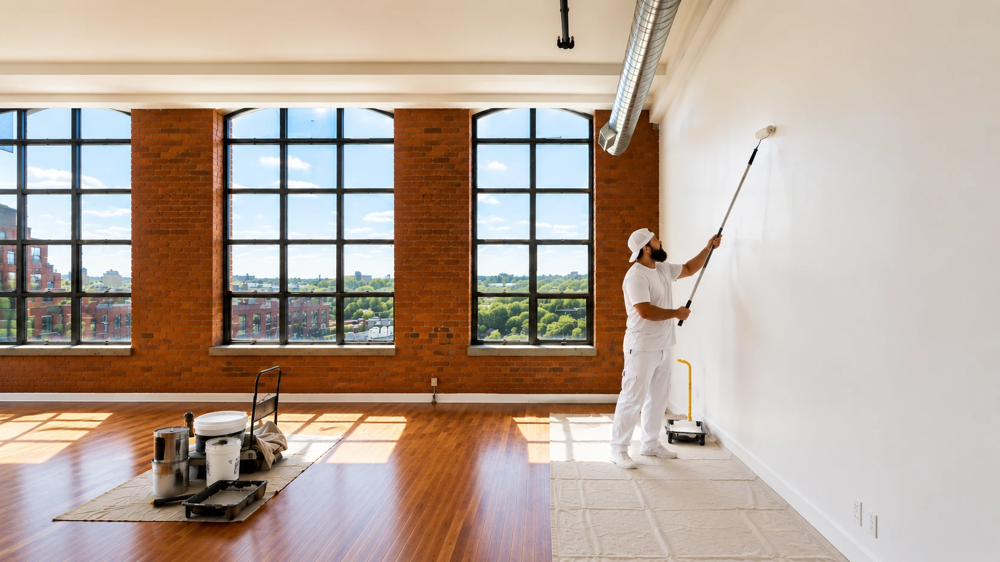

# Cornerstone Painting — Website Handoff Document

**Live URL:** https://jaygonzalez-arch.github.io/Website-corner/  
**Repository:** jaygonzalez-arch/Website-corner  
**Last updated:** May 2026

---

## Project Overview

A static marketing website for Cornerstone Painting, a residential and commercial painting contractor serving Toronto and the Greater Toronto Area since 2009. The site has no framework or build tool — it is pure HTML, CSS, and vanilla JavaScript, deployed directly to GitHub Pages.

---

## Website Purpose

Generate inbound leads. Every page is designed to move a visitor toward one of two actions:

1. **Fill out the estimate form** (slide-out drawer, available from every page)
2. **Call directly** — `437-242-3829`

---

## Target Customer

GTA homeowners (Toronto, Markham, Vaughan, Richmond Hill, Newmarket, Aurora, Woodbridge, King City) who want a professional painting company with transparent pricing, clean crews, and a written guarantee.

---

## Full Page List

| File | URL path | Purpose |
|---|---|---|
| `index.html` | `/` | Homepage — hero, services preview, reviews, FAQ, quote form |
| `services.html` | `/services.html` | Full service breakdown with detail sections |
| `about.html` | `/about.html` | Company story, values, what sets them apart |
| `gallery.html` | `/gallery.html` | Photo gallery — interior and exterior projects |
| `areas.html` | `/areas.html` | Service area map and city list |
| `blog.html` | `/blog.html` | Blog article listing page |
| `blog-*.html` (25 files) | `/blog-*.html` | Individual blog articles |
| `painters-toronto.html` | `/painters-toronto.html` | City landing page — Toronto |
| `painters-markham.html` | `/painters-markham.html` | City landing page — Markham |
| `painters-vaughan.html` | `/painters-vaughan.html` | City landing page — Vaughan |
| `painters-richmond-hill.html` | `/painters-richmond-hill.html` | City landing page — Richmond Hill |
| `painters-newmarket.html` | `/painters-newmarket.html` | City landing page — Newmarket |
| `painters-aurora.html` | `/painters-aurora.html` | City landing page — Aurora |
| `painters-woodbridge.html` | `/painters-woodbridge.html` | City landing page — Woodbridge |
| `painters-king-city.html` | `/painters-king-city.html` | City landing page — King City |
| `preview.html` | *(internal only)* | 5.9 MB design preview — not a live page, do not link to it |

---

## Section-by-Section Breakdown

### Homepage (`index.html`)

| Section | CSS class / ID | Content |
|---|---|---|
| Navigation | `nav`, `.nav-inner` | Logo, nav links, phone, Estimate button, hamburger |
| Hero | `.hero`, `section.hero` | Headline, CTA button, phone button, trust row |
| Why Cornerstone | `.why-section` `#about` | Headline, body copy, 3 stats (500+ projects, 15yr, 100%) |
| Feature Cards | `.feat-cards-section` | 4 feature cards (Written Quotes, Clean Crews, etc.) |
| Reviews | `.reviews-section` `#reviews` | Auto-scrolling carousel with 5 Google reviews (duplicated for loop) |
| How It Works | `.how-section` | 3-step process: Call → Estimate → Painting |
| FAQ | `.faq-section` | Accordion with 6 common questions |
| Quote Form | `.quote-section` `#contact` | Name, email, phone, service, message, submit button |
| Footer | `.site-footer` | Logo, nav links, phone, email, address, social links |
| Estimate Drawer | `#est-overlay` | 3-step slide-out modal (Service → Details → Contact) |
| Floating Phone | `.float-cta` | Fixed phone button bottom-right (mobile only) |

### Services Page (`services.html`)

| Section | ID | Content |
|---|---|---|
| Services Grid | `.svc-overview` | 6 service cards overview |
| Interior Painting | `#interior` | Full description, image, feature list |
| Exterior Painting | `#exterior` | Full description, image, feature list |
| Cabinet Painting | *(no id)* | Full description, image |
| Expert Spray Finishes | *(no id)* | Full description, image |
| Commercial Painting | `#commercial` | Full description, feature cards |
| Specialty Services | `.svc-specialty` | Drywall, popcorn removal, staining |
| CTA Band | `#contact` | "Get a Free Quote" call to action |

### About Page (`about.html`)

| Section | Content |
|---|---|
| Hero | "Painters you can actually trust." |
| Our Story | Company history, left side |
| What Sets Us Apart | Differentiators, right side |
| Values | Core values grid |
| CTA Band | "Ready to Work Together?" |

### Gallery Page (`gallery.html`)

- Filterable grid with 24 projects
- Tabs: All / Interior / Exterior
- Lightbox on click
- Real project photos: `gallery-int-real-*.jpg` (interior), `gallery-ext-real-*.jpg` (exterior)

### Areas Page (`areas.html`)

- List of all cities served
- Links to individual city landing pages
- CTA band at bottom

### City Landing Pages (`painters-*.html`)

All 8 pages follow the same template — generated from `_generate_city_pages.py`. Each has:
- City-specific headline and meta description
- Services section
- Reviews
- CTA band
- Estimate drawer

---

## File Structure

```
Website-corner/
│
├── index.html                  # Homepage
├── services.html               # Services
├── about.html                  # About
├── gallery.html                # Gallery
├── areas.html                  # Areas
├── blog.html                   # Blog listing
├── blog-*.html                 # 25 blog articles
├── painters-*.html             # 8 city landing pages
│
├── styles.css                  # ALL site styles (83 KB, ~3900 lines)
├── animations.js               # Scroll-triggered fade/slide animations
├── estimate.js                 # Estimate drawer: 3-step form + EmailJS submit
│
├── logo.svg                    # Logo — vector source (use this for print)
├── logo.webp                   # Logo — raster for browser use
├── favicon.svg                 # Favicon — SVG (primary, modern browsers)
├── favicon.png                 # Favicon — 64×64 PNG
├── favicon.ico                 # Favicon — 16/32/48 px ICO (legacy)
│
├── hero-bg.webp                # Hero background — desktop
├── hero-mobile-painter.jpg     # Hero background — mobile (≤960px)
├── interior-painting.webp      # Services section image
├── exterior-painting.webp      # Services section image
├── cabinet-painting.jpg        # Services section image
├── spray-finishes.jpg          # Services section image
│
├── gallery-int-real-1..5.jpg   # Real interior project photos
├── gallery-ext-real-1..5.jpg   # Real exterior project photos
├── gallery-*.webp              # Additional gallery images (stock)
│
├── _generate_city_pages.py     # Script: generates painters-*.html from template
├── _inject_animations.py       # Script: injects animation HTML into all pages
├── _inject_estimate.py         # Script: injects estimate drawer into all pages
│
├── preview.html                # INTERNAL ONLY — 5.9 MB design document
├── debug.js                    # Dev utility — not used in production
├── screenshot.js               # Dev utility — not used in production
├── package.json                # Only has screenshot dep (not needed for site)
├── node_modules/               # Screenshot tool only — not needed for site
│
└── *.png                       # Development screenshots — safe to delete
```

---

## Technologies Used

| Technology | Version / Source | Purpose |
|---|---|---|
| HTML5 | — | Page markup |
| CSS3 | `styles.css` | All styles, layout, animations |
| Vanilla JS | `animations.js`, `estimate.js` | No jQuery, no framework |
| Google Fonts | fonts.googleapis.com | Noto Serif (body + h2/h3), Carlito Bold (h1) |
| EmailJS | cdn.jsdelivr.net `@emailjs/browser@4` | Form submission → email delivery |
| GitHub Pages | gh-pages branch | Hosting — free, no server required |
| Git | two-branch workflow | See Deploy section below |

**No npm build step.** The CSS and JS are written directly — no Sass, no Webpack, no TypeScript. Changes to `styles.css` or JS files take effect immediately on save.

---

## Design Tokens (CSS Variables)

Defined at the top of `styles.css` inside `:root {}`:

```css
--accent:  #c4602a   /* burnt orange — buttons, highlights, stars */
--dark:    #111111   /* near-black — nav background, dark sections */
--off:     #f5f3ef   /* warm off-white — page background */
--linen:   #ede8de   /* warm beige — alternate section background */
--text:    #2a2622   /* dark brown — body copy */
--white:   #ffffff
--nav-h:   116px     /* nav height — used for scroll offsets */
--max:     1280px    /* max content width */
```

---

## Typography

| Element | Font | Weight |
|---|---|---|
| `h1` (hero, page titles) | Carlito | 700 Bold |
| `h2`, `h3`, section headings | Noto Serif | 700 Bold |
| Body text, paragraphs | Noto Serif | 400 Regular |
| Eyebrows, labels, nav | inherits Noto Serif | 600–700 |

Google Fonts import is in every HTML file's `<head>`:
```html
<link rel="preconnect" href="https://fonts.googleapis.com" />
<link rel="preconnect" href="https://fonts.gstatic.com" crossorigin />
<link href="https://fonts.googleapis.com/css2?family=Carlito:ital,wght@0,400;0,700;1,400;1,700&family=Noto+Serif:ital,wght@0,400;0,700;1,400&display=swap" rel="stylesheet" />
```

---

## How to Edit Text

All text is hard-coded in HTML. Open the relevant `.html` file and edit directly.

**Hero headline** — `index.html` around line 80:
```html
<h1>Premium Painting<br>in Toronto &amp; the GTA —<br>Clean Crews, Written Quotes,<br><em>Guaranteed Finish.</em></h1>
```

**Hero sub-paragraph** — `index.html` around line 84 (hidden on mobile):
```html
<p class="hero-sub">Interior, exterior, and cabinet painting...</p>
```

**Reviews** — `index.html` inside `.reviews-track`. Reviews are duplicated (two identical sets) for the infinite scroll effect. **Edit both copies.**

**Phone number** — appears 5+ times across `index.html` and in every other page. Use Find & Replace across all files: `437-242-3829` → new number. Also update `tel:+14372423829`.

**Email address** — `hello@cornerstonepainting.ca` appears in the footer of every page.

**Footer address / hours** — inside `.site-footer` in each HTML file. All pages share the same footer structure — update each file or use a find-replace.

**Blog posts** — each `blog-*.html` file is self-contained. Edit the article body directly in the file.

**City pages** — `painters-*.html`. These were generated by `_generate_city_pages.py`. You can edit them manually or re-run the script with updated content to regenerate all 8 at once.

---

## How to Replace Images

Images are referenced directly by filename in the HTML:

```html

```

To replace an image:
1. Prepare your new image (same filename, or a new name)
2. Drop it in the root folder (same level as `index.html`)
3. If using a new filename, find the old filename in the HTML and update it

**Key images to know:**

| File | Where used | Recommended size |
|---|---|---|
| `hero-bg.webp` | Hero background — desktop | 1600×900 minimum |
| `hero-mobile-painter.jpg` | Hero background — mobile (≤960px) | 800×1200 portrait |
| `interior-painting.webp` | Services section | 800×600 |
| `exterior-painting.webp` | Services section | 800×600 |
| `cabinet-painting.jpg` | Services section | 800×600 |
| `spray-finishes.jpg` | Services section | 800×600 |
| `gallery-int-real-1..5.jpg` | Gallery — Interior tab | 1200×900 minimum |
| `gallery-ext-real-1..5.jpg` | Gallery — Exterior tab | 1200×900 minimum |
| `logo.svg` | Nav on every page | SVG — scale-free |

**WebP vs JPG:** Use `.webp` where possible — files are 30–50% smaller. All modern browsers support it. Keep `.jpg` fallbacks only if you need IE11 support (unlikely).

---

## How to Update Buttons and Links

### CTA Buttons

The primary "GET A FREE QUOTE" button in the hero links to `#contact` (the quote form section on the same page):
```html
<a href="#contact" class="btn btn-accent btn-hero-primary">GET A FREE QUOTE &nbsp;→</a>
```

The "Estimate" button in the nav opens the slide-out estimate drawer:
```html
<button class="nav-estimate-btn" id="open-estimate">Estimate</button>
```
This is wired in `estimate.js` — do not change the `id="open-estimate"`.

### Nav Links

In every HTML file, the nav links are:
```html
<ul class="nav-links">
  <li><a href="services.html">Services</a></li>
  <li><a href="about.html">About</a></li>
  <li><a href="gallery.html">Gallery</a></li>
  <li><a href="areas.html">Areas</a></li>
  <li><a href="blog.html">Blog</a></li>
</ul>
```
To add or remove a nav item, update this block in every HTML file (38 files). Use Find & Replace across files.

### Social Links

In the nav `.nav-socials` and the footer, Facebook and Instagram links appear. Replace the `href` values with the actual profile URLs:
```html
<a href="#" class="social-link" aria-label="Facebook">...</a>
<a href="#" class="social-link" aria-label="Instagram">...</a>
```
Currently `href="#"` — these need real URLs.

### Footer Links

The footer contains nav links (same as nav), phone, email, and a Google Maps address link. Update in every page's `<footer class="site-footer">` block.

---

## Form & Email Configuration

Estimate requests and quote form submissions are sent via **EmailJS** — no server required.

| Setting | Value |
|---|---|
| EmailJS Public Key | `jzTGEVeLn4nHdZx36` |
| Service ID | `service_65u9teq` |
| Template ID | `template_umgubsc` |
| JS file | `estimate.js` (top of file) |

To change where emails are delivered, log into [emailjs.com](https://emailjs.com), navigate to Email Services → `service_65u9teq`, and update the connected email address. No code changes needed.

To change the email template (subject line, body format), go to Email Templates → `template_umgubsc`.

---

## Deploy Workflow

The site uses **two branches**:

| Branch | Purpose |
|---|---|
| `claude/website-hero-services-6N66p` | Active development branch |
| `gh-pages` | Live site — GitHub Pages serves this branch |

**To deploy changes:**
```bash
# 1. Make and commit changes on the feature branch
git add -A
git commit -m "Your message"

# 2. Merge to gh-pages
git checkout gh-pages
git merge --ff-only claude/website-hero-services-6N66p
git push -u origin gh-pages

# 3. Return to dev branch
git checkout claude/website-hero-services-6N66p
```

GitHub Pages picks up the push within ~30–60 seconds.

---

## CSS Version Cache-Busting

Every HTML file references the stylesheet with a version query string:
```html
<link rel="stylesheet" href="styles.css?v=37" />
```

**Every time you edit `styles.css`, you must bump this number across all HTML files**, otherwise users with cached pages won't see the change.

Quick way to bump all 38 files at once (example, terminal in project root):
```bash
# Change v=37 to v=38
sed -i 's/styles\.css?v=37/styles.css?v=38/g' *.html
```

Current version: **v=37**

---

## Important Notes for Future Developers

1. **No build step.** Edit `styles.css` and `*.html` directly. Save → deploy. There is no Webpack, no Sass, no TypeScript compiler.

2. **All 38 HTML files share one CSS file.** A change in `styles.css` affects every page. Changes in one HTML file affect only that page. The nav, footer, and estimate drawer HTML are duplicated in every file — not a shared component.

3. **The estimate drawer HTML is in every page.** If you need to update its content (step labels, service options, etc.), you must update all 38 files. The Python script `_inject_estimate.py` was used to inject it initially and can be adapted for bulk updates.

4. **Reviews carousel needs duplicate rows.** The infinite-scroll reviews carousel works by duplicating the review cards. `.reviews-track` contains the full set of reviews twice. If you add or remove reviews, duplicate the full set again.

5. **Mobile breakpoints.** The main mobile breakpoint is `@media (max-width: 600px)` at the bottom of `styles.css` (~line 3152). There is also a `@media (max-width: 768px)` block (~line 1986) and a `@media (max-width: 480px)` block (~line 2027).

6. **Social media links are placeholders.** Facebook and Instagram links currently use `href="#"`. These need real URLs before launch.

7. **Hero paragraph is hidden on mobile.** The `.hero-sub` paragraph (the descriptive sentence below the headline) is `display: none` on mobile (`max-width: 600px`). This is intentional — the mobile view shows: eyebrow → headline → CTA buttons → trust row only.

8. **`preview.html` is not a live page.** It is 5.9 MB and contains internal design mockups. Do not link to it. It is safe to delete from production if desired.

9. **Development files safe to delete.** The following are not needed for the live site: `debug.js`, `screenshot.js`, `package.json`, `node_modules/`, and all `*.png` files in the root (they are development screenshots, not site assets).

10. **City pages were auto-generated.** The 8 `painters-*.html` files were created by `_generate_city_pages.py`. If you add a new service area, use this script as a template rather than copying HTML by hand.

---

## Known Issues & Limitations

| Issue | Detail |
|---|---|
| **Social links are empty** | Facebook and Instagram `href="#"` on all pages — needs real URLs |
| **No CMS** | All content is hard-coded in HTML. Text changes require a developer to edit files directly. No admin panel. |
| **Nav/footer duplication** | The nav and footer HTML exists in all 38 files. A nav change requires updating every file. |
| **No HTTPS redirect** | GitHub Pages provides HTTPS but doesn't force a redirect from HTTP. |
| **Google Analytics / tracking** | No analytics script is installed. Add GA4 or equivalent if tracking is needed. |
| **No sitemap.xml** | No XML sitemap exists for SEO crawlers. Recommended addition. |
| **No robots.txt** | No robots.txt file. Default behavior allows all crawlers including to `preview.html`. |
| **EmailJS public key in source** | The EmailJS public key is visible in `estimate.js`. This is expected for EmailJS (it's a client-side API) but the domain should be restricted in the EmailJS dashboard to prevent abuse. |
| **Gallery images are mixed stock + real** | `gallery-*.webp` files are stock photos. The `gallery-*-real-*.jpg` files are actual project photos. Replace stock photos with real project images over time. |

---

## Contact & Business Details

| | |
|---|---|
| **Business name** | Cornerstone Painting |
| **Phone** | 437-242-3829 |
| **Email** | hello@cornerstonepainting.ca |
| **Service area** | Toronto and the GTA |
| **Established** | 2009 |
